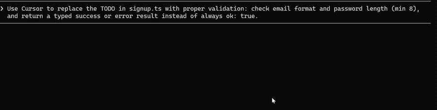

# Cursor Delegate MCP

**Let Claude think. Let Cursor build.**

[](https://www.npmjs.com/package/cursor-delegate-mcp)
[](https://www.npmjs.com/package/cursor-delegate-mcp)
[](https://nodejs.org)
[](LICENSE)

An MCP server that lets Claude Code (or any MCP client) delegate coding tasks to **Cursor's CLI agent** — and get structured results back, not a wall of terminal text.



## Why

Frontier models like **Opus** and **Fable** are brilliant orchestrators — great at understanding intent, planning, and reviewing. Cursor's **Composer** is a fast, cheap workhorse for the actual edits, with its own generous usage pool.

This bridge pairs them: the big brain writes the brief and reviews the diff; Cursor does the typing. Your Claude quota goes to thinking, not boilerplate.

## How it works

```
You  →  Claude (Opus / Fable — plans & reviews)
              │  MCP delegate tool
              ▼
        cursor-agent (Composer 2.5 — implements)
              │  edits your workspace
              ▼
        Structured result: files changed, session id, plan
```

Delegation defaults to Cursor's **Composer 2.5**, which draws from the separate **Auto + Composer** usage pool — so implementation work doesn't eat into your API-model quota. Want a different model? Just say so: *"delegate with Opus"*.

**Three modes:** `agent` (implement, default) · `plan` (draft a plan, review, resume to implement) · `ask` (read-only Q&A).

> **Note:** delegation auto-approves file writes in the target workspace — review the diff afterward, like any teammate's work.

## Features

- 🤝 **Perfect Claude Code integration** — ships as a plugin with a skill, slash command, and hooks. Just say *"delegate this to Cursor"* and it happens.
- 💬 **Answers Cursor's questions** — when Cursor needs a clarification mid-run, the question surfaces in your client's normal prompt. No stalled sessions. (On clients without interactive prompts, the recommended option is auto-selected and reported back.)
- 📦 **Structured results** — session id, files changed, stop reason, and plan payload. Claude knows exactly what happened and what to review.
- 📋 **Plan mode** — have Cursor draft a plan first, review it, then resume the same session to implement.
- 🔍 **Ask mode** — read-only Q&A over the codebase, zero file changes.
- 🩺 **Built-in diagnostics** — a `doctor` tool that tells you exactly what's missing if setup isn't right.
- 🔌 **Works everywhere MCP does** — Claude Code, VS Code, Codex CLI, Kiro, Kilo Code, and more.

## Quick start

**Requirements:** [Node.js 22+](https://nodejs.org/) and [cursor-agent](https://cursor.com/docs/cli/overview) logged in (`cursor-agent login`).

### Claude Code (recommended)

```shell
/plugin marketplace add andreilungeanu/cursor-delegate-mcp
/plugin install cursor-delegate-mcp@cursor-delegate-mcp
```

Then just ask:

> Delegate to Cursor: migrate src/api from callbacks to async/await and update the tests, then walk me through what changed.

Claude writes the brief, Cursor grinds through the files, and Claude reviews the diff with you — that's the whole loop.


### Any other MCP client

```json
{
  "mcpServers": {
    "cursor-delegate-mcp": {
      "command": "npx",
      "args": ["-y", "cursor-delegate-mcp"]
    }
  }
}
```

<details>
<summary><strong>VS Code</strong> — <code>.vscode/mcp.json</code></summary>

```json
{
  "servers": {
    "cursor-delegate-mcp": {
      "type": "stdio",
      "command": "npx",
      "args": ["-y", "cursor-delegate-mcp"]
    }
  }
}
```

</details>

<details>
<summary><strong>Codex CLI</strong> — <code>~/.codex/config.toml</code></summary>

```toml
[mcp_servers.cursor-delegate-mcp]
command = "npx"
args = ["-y", "cursor-delegate-mcp"]
```

</details>

<details>
<summary><strong>Kiro</strong> — <code>~/.kiro/settings/mcp.json</code></summary>

```json
{
  "mcpServers": {
    "cursor-delegate-mcp": {
      "command": "npx",
      "args": ["-y", "cursor-delegate-mcp"]
    }
  }
}
```

</details>

<details>
<summary><strong>Kilo Code</strong> — <code>~/.config/kilo/kilo.jsonc</code></summary>

```jsonc
{
  "mcp": {
    "cursor-delegate-mcp": {
      "type": "local",
      "command": ["npx", "-y", "cursor-delegate-mcp"],
      "enabled": true
    }
  }
}
```

</details>

<details>
<summary><strong>Antigravity 2.0</strong> — <code>~/.gemini/config/mcp_config.json</code></summary>

```json
{
  "mcpServers": {
    "cursor-delegate-mcp": {
      "command": "npx",
      "args": ["-y", "cursor-delegate-mcp"]
    }
  }
}
```

</details>

Call the **`delegate`** tool with your task; run **`doctor`** if anything seems off.

## License

MIT © [Andrei Lungeanu](https://github.com/andreilungeanu)
