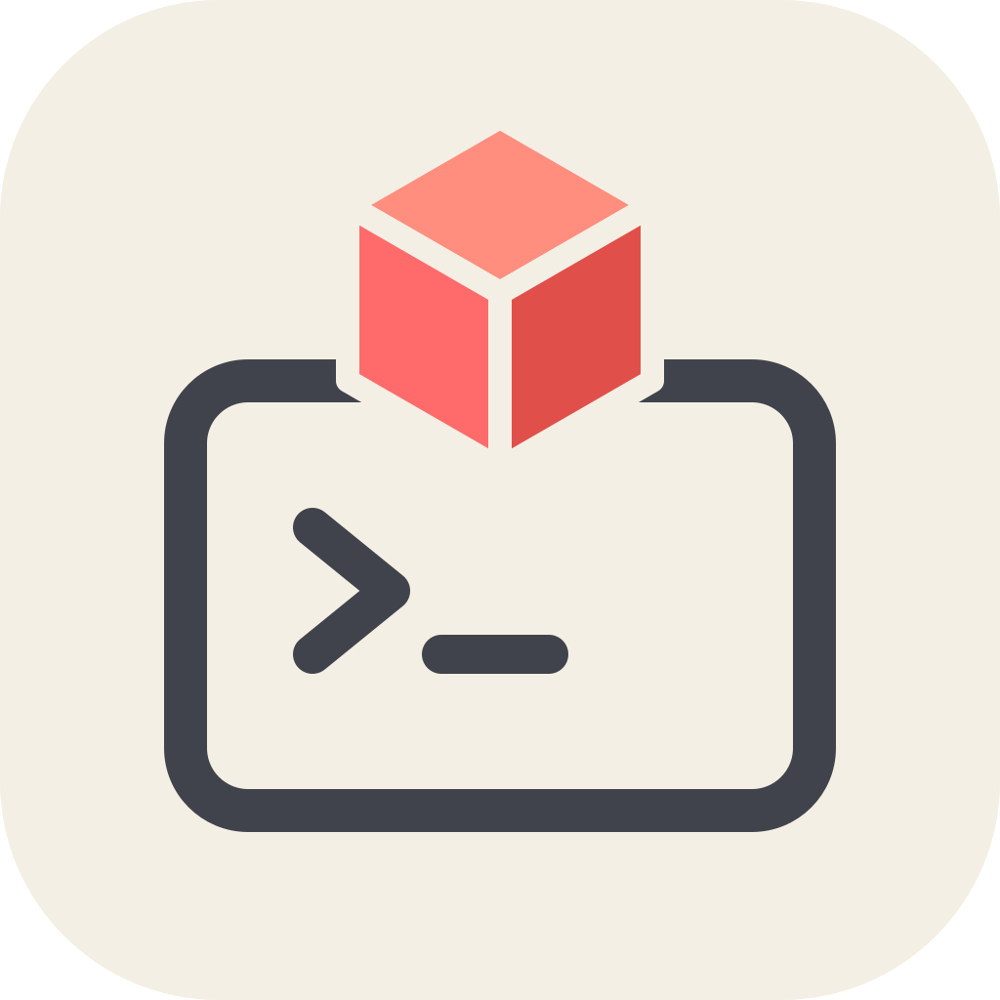

# Cursor Delegate MCP

**Keep the brains. Delegate the build.**

[](https://www.npmjs.com/package/cursor-delegate-mcp)
[](https://www.npmjs.com/package/cursor-delegate-mcp)
[](https://nodejs.org)
[](LICENSE)
[](https://github.com/andreilungeanu/cursor-delegate-mcp/actions/workflows/test.yml)



Use your best coding agent where its judgment matters most: understanding the task, shaping the plan, and reviewing the result.

Cursor Delegate is the MCP bridge that lets Claude Code, ChatGPT/Codex, Copilot — or any MCP client — hand implementation to **Cursor's CLI agent**, then get a clean, structured result back for review.

<br clear="left">


## 🧠 Frontier quality, kept

Your assistant does what frontier models are actually for: understands the task, writes a precise brief, reviews the finished diff. And **Composer 2.5** holds its own — a seriously capable coding model, just guided and checked by a smarter one. The result reads like frontier work, because a frontier model planned it and signed off on it.

## ⚡ Done faster

Composer 2.5 is built for speed. It tears through multi-file edits while a frontier model would still be streaming the first file. You delegate, keep working with your assistant, and the diff shows up done.

## 🔋 Your limits stop being the bottleneck

Delegated work bills to Composer's **own usage pool** — separate from Cursor's API-priced main quota, and so generous most users never hit its ceiling. Your Claude or Codex subscription spends tokens only on the brief and the review, so the 5-hour window and weekly limits go a lot further. On API? That's the per-token grind moved off your bill.

```
You  →  your agent (plans & reviews)
              │  MCP delegate tool
              ▼
        cursor-agent (Composer 2.5 — implements)
              │  edits your workspace
              ▼
        Clean result: what changed, which files, the plan
```

## Features

- 🤝 **Native plugins** — install into Claude Code, ChatGPT/Codex, or GitHub Copilot CLI and just say *"delegate this to Cursor"*. The shared skill teaches your agent how to delegate well.
- 💬 **No stalled runs** — if Cursor asks a question mid-task, it pops up as a normal prompt in your client. In clients without that support, the recommended option is picked automatically and reported back, so nothing hangs.
- 📦 **Clean, typed results** — final answer, changed files, session id, and the plan, returned as validated structured output. Nothing to parse, nothing to guess.
- 📋 **Plan first** — `plan` mode: Cursor drafts a plan, you review it, then the same session implements it.
- 🔍 **Ask anything** — `ask` mode: read-only Q&A over your codebase, zero file changes.
- 🩺 **Self-diagnosing** — a `doctor` tool that tells you exactly what's missing if setup isn't right.
- 🔌 **Works everywhere MCP does** — VS Code, JetBrains, Windsurf, Visual Studio, and more.

## Quick start

You need [Node.js 22+](https://nodejs.org/) and the [Cursor CLI](https://cursor.com/docs/cli/overview), logged in (`cursor-agent login`).

### Claude Code

```shell
/plugin marketplace add andreilungeanu/cursor-delegate-mcp
/plugin install cursor-delegate-mcp@cursor-delegate-mcp
```

Then just ask:

> Delegate to Cursor: migrate src/api from callbacks to async/await and update the tests, then walk me through what changed.

That's the whole loop — Claude writes the brief, Cursor grinds through the files, Claude walks you through the diff.

### ChatGPT desktop / Codex

```shell
codex plugin marketplace add andreilungeanu/cursor-delegate-mcp
codex plugin add cursor-delegate-mcp@cursor-delegate-mcp
```

### GitHub Copilot CLI

```shell
copilot plugin install andreilungeanu/cursor-delegate-mcp
```

### More clients

<details>
<summary><strong>VS Code</strong> — <code>.vscode/mcp.json</code></summary>

```json
{
  "servers": {
    "cursor-delegate-mcp": {
      "type": "stdio",
      "command": "npx",
      "args": ["-y", "cursor-delegate-mcp"]
    }
  }
}
```

Or run **Chat: Install Plugin From Source** with this repository's URL.

</details>

<details>
<summary><strong>JetBrains AI Assistant</strong> — Settings → Tools → AI Assistant → MCP</summary>

Under **Settings → Tools → AI Assistant → Model Context Protocol (MCP)**, add a server with command `npx` and arguments `-y cursor-delegate-mcp`.

</details>

<details>
<summary><strong>Windsurf</strong> — <code>~/.codeium/windsurf/mcp_config.json</code></summary>

```json
{
  "mcpServers": {
    "cursor-delegate-mcp": {
      "command": "npx",
      "args": ["-y", "cursor-delegate-mcp"]
    }
  }
}
```

Heads-up: Cascade caps you at 100 tools across all servers.

</details>

<details>
<summary><strong>Visual Studio 2022</strong> — <code>%USERPROFILE%\.mcp.json</code></summary>

```json
{
  "servers": {
    "cursor-delegate-mcp": {
      "type": "stdio",
      "command": "npx",
      "args": ["-y", "cursor-delegate-mcp"]
    }
  }
}
```

Requires 17.14+. Note the top-level key is `servers`, not `mcpServers`.

</details>

### Kiro, Kilo Code, and any other MCP client

Add the following server to the client's MCP config:

```json
{
  "mcpServers": {
    "cursor-delegate-mcp": {
      "command": "npx",
      "args": ["-y", "cursor-delegate-mcp"]
    }
  }
}
```

## License

MIT © [Andrei Lungeanu](https://github.com/andreilungeanu)

<sub>[Security](SECURITY.md) · [Privacy](PRIVACY.md) · [Terms](TERMS.md) · [Changelog](CHANGELOG.md)</sub>
