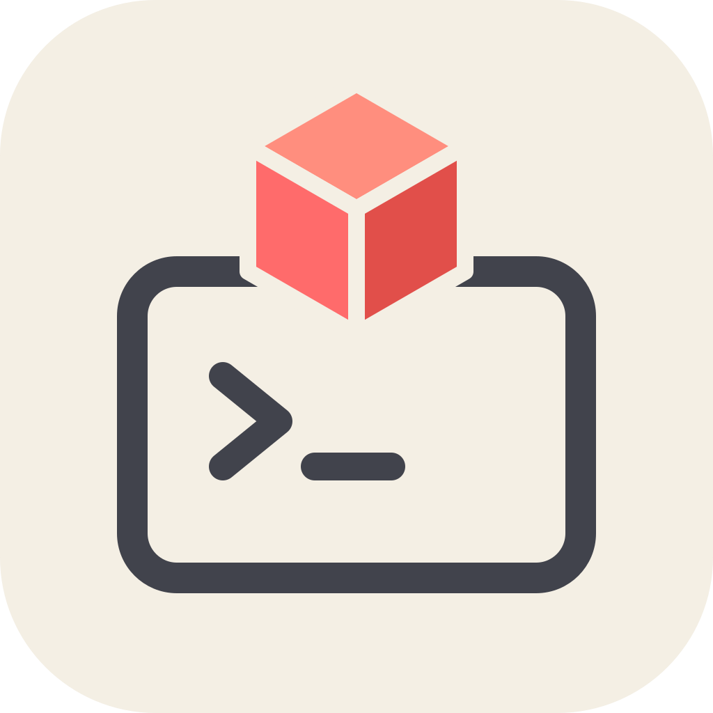
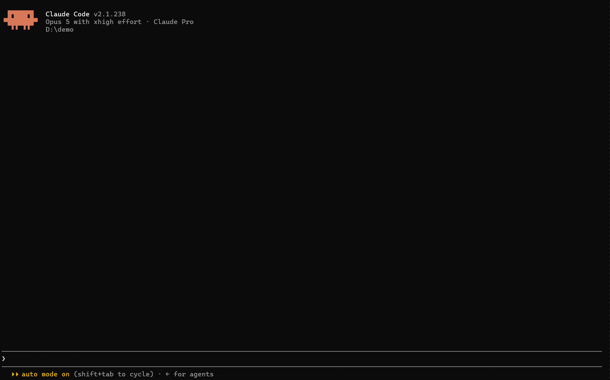
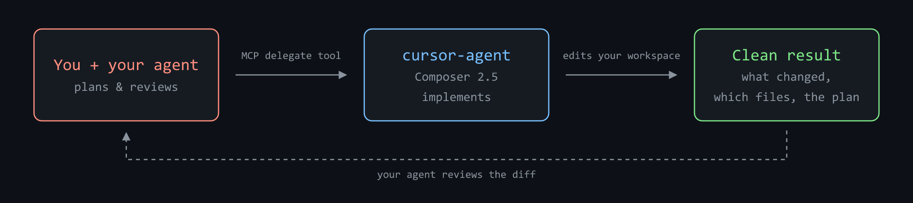
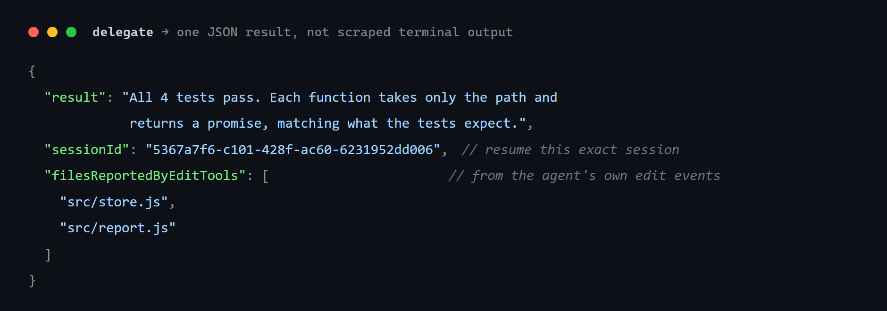

# Cursor Delegate

**Stop burning your frontier agent's limits on boilerplate.** 

Delegate edits to Cursor's CLI agent — your agent writes the brief and reviews the diff.

[](https://www.npmjs.com/package/cursor-delegate-mcp)
[](https://www.npmjs.com/package/cursor-delegate-mcp)
[](https://registry.modelcontextprotocol.io/v0/servers?search=cursor-delegate)
[](https://glama.ai/mcp/servers/andreilungeanu/cursor-delegate-mcp)
[](https://nodejs.org)
[](LICENSE)
[](https://github.com/andreilungeanu/cursor-delegate-mcp/actions/workflows/test.yml)



Use your best coding agent where its judgment matters most: understanding the task, shaping the plan, and reviewing the result.

Cursor Delegate is the MCP bridge that lets Claude Code, ChatGPT/Codex, Copilot — or any MCP client — hand implementation to **Cursor's CLI agent**, then get a clean, structured result back for review.

<br clear="left">



## 🧠 Frontier quality, kept

Your assistant does what frontier models are for: understands the task, writes a precise brief, reviews the finished diff. **Composer 2.5** runs the implementation loop under that brief. The bundled skill puts the review step in the loop — the agent that scoped the work reads the changed files back before reporting.

## ⚡ Done faster

Composer 2.5 is built for throughput on multi-file edits. The whole delegation is one call — brief in, result out — so you review a finished diff instead of babysitting edits landing file by file.

## 🔋 Your limits stop being the bottleneck

Composer and Grok run on their **own usage allowance** on every Cursor plan — separate from the API-priced main quota, and generous enough that most people never reach the ceiling. Your Claude or Codex subscription spends tokens only on the brief and the review, so the 5-hour window and weekly limits go a lot further. Paying per token on API? That grind moves onto Cursor capacity you already have.





## Features

- 🤝 **Native plugins** — install into Claude Code, ChatGPT/Codex, or GitHub Copilot CLI and just say *"delegate this to Cursor"*. The shared skill teaches your agent how to delegate well.
- 💬 **No stalled runs** — if Cursor needs to clarify, it ends the turn and returns the question as a normal result. Your agent reads it and answers by resuming the same session — nothing blocks on a modal waiting for input.
- 📦 **Clean, named results** — final answer, changed files, session id, and the plan, returned as one compact JSON payload. Nothing to scrape.
- 📋 **Plan first** — `plan` mode: Cursor drafts a plan, you review it, then the same session implements it.
- 🔍 **Ask anything** — `ask` mode: Q&A over your codebase.
- 🩺 **Self-diagnosing** — a `doctor` tool that tells you exactly what's missing if setup isn't right.
- 🔌 **Portable** — plain stdio MCP, so it runs anywhere: VS Code, JetBrains, Windsurf, Visual Studio, OpenCode, Antigravity, and more.

`plan` and `ask` are instructions to the agent, and `workspace` is its working directory — [Security](SECURITY.md) and the [delegate reference](skills/delegate/reference.md) spell out what the bridge enforces and what it reports back.

## Install

You need [Node.js 20+](https://nodejs.org/) and the [Cursor CLI](https://cursor.com/docs/cli/overview), logged in (`cursor-agent login`).

### Claude Code

```shell
/plugin marketplace add andreilungeanu/cursor-delegate-mcp
/plugin install cursor-delegate@cursor-delegate-mcp
```

Then just ask:

> Delegate to Cursor: migrate src/api from callbacks to async/await and update the tests, then walk me through what changed.

That's the whole loop — Claude writes the brief, Cursor grinds through the files, Claude walks you through the diff.

### ChatGPT desktop / Codex

```shell
codex plugin marketplace add andreilungeanu/cursor-delegate-mcp
codex plugin add cursor-delegate@cursor-delegate-mcp
```

### GitHub Copilot CLI

```shell
copilot plugin install andreilungeanu/cursor-delegate-mcp
```

### Any other MCP client

```json
{
  "mcpServers": {
    "cursor-delegate": {
      "command": "npx",
      "args": ["-y", "cursor-delegate-mcp"]
    }
  }
}
```

### Client-specific config locations

<details>
<summary><strong>VS Code</strong> — one-click install, or <code>.vscode/mcp.json</code></summary>

[](https://vscode.dev/redirect/mcp/install?name=cursor-delegate&config=%7B%22type%22%3A%22stdio%22%2C%22command%22%3A%22npx%22%2C%22args%22%3A%5B%22-y%22%2C%22cursor-delegate-mcp%22%5D%7D)
[](https://insiders.vscode.dev/redirect/mcp/install?name=cursor-delegate&config=%7B%22type%22%3A%22stdio%22%2C%22command%22%3A%22npx%22%2C%22args%22%3A%5B%22-y%22%2C%22cursor-delegate-mcp%22%5D%7D&quality=insiders)

Or add it manually:

```json
{
  "servers": {
    "cursor-delegate": {
      "type": "stdio",
      "command": "npx",
      "args": ["-y", "cursor-delegate-mcp"]
    }
  }
}
```

Or run **Chat: Install Plugin From Source** with this repository's URL.

</details>

<details>
<summary><strong>JetBrains AI Assistant</strong> — Settings → Tools → AI Assistant → MCP</summary>

Under **Settings → Tools → AI Assistant → Model Context Protocol (MCP)**, add a server with command `npx` and arguments `-y cursor-delegate-mcp`.

</details>

<details>
<summary><strong>Windsurf</strong> — <code>~/.codeium/windsurf/mcp_config.json</code></summary>

Same `mcpServers` block as the generic snippet above. Cascade caps you at 100 tools across all servers.

</details>

<details>
<summary><strong>Visual Studio 2022 / 2026</strong> — <code>%USERPROFILE%\.mcp.json</code></summary>

Same `servers` + `type: "stdio"` shape as VS Code. Requires Visual Studio 2026, or 2022 17.14+. Note the top-level key is `servers`, not `mcpServers`. Visual Studio also discovers `.mcp.json` next to the solution, plus `.vscode/mcp.json`.

</details>

<details>
<summary><strong>OpenCode</strong> — <code>~/.config/opencode/opencode.json</code> or project <code>opencode.json</code></summary>

OpenCode does **not** use `mcpServers`. Local servers go under `mcp`, with `type: "local"` and `command` as one array:

```json
{
  "$schema": "https://opencode.ai/config.json",
  "mcp": {
    "cursor-delegate": {
      "type": "local",
      "command": ["npx", "-y", "cursor-delegate-mcp"],
      "enabled": true
    }
  }
}
```

</details>

<details>
<summary><strong>Google Antigravity</strong> — <code>~/.gemini/config/mcp_config.json</code> or workspace <code>.agents/mcp_config.json</code></summary>

Same `mcpServers` block as the generic snippet above. In the IDE: **…** on the agent panel → **MCP Servers** → **Manage MCP Servers** → **View raw config**. Antigravity 2.0, IDE, and CLI share the Gemini config file. You may need to approve the server's tools on first run.

</details>

<details>
<summary><strong>Kiro</strong> — <code>.kiro/settings/mcp.json</code> or <code>~/.kiro/settings/mcp.json</code></summary>

Same `mcpServers` block as the generic snippet above. Workspace file wins when both exist.

</details>

<details>
<summary><strong>Kilo Code</strong> — <code>kilo.jsonc</code> (<code>mcp</code> key, not <code>mcpServers</code>)</summary>

Same shape as OpenCode: `type: "local"` and `command` as one array. In the VS Code extension: **Settings → MCP → Add Server → Local (stdio)**. On Windows, if `npx` is not found, use command `cmd` with arguments `/c`, `npx`, `-y`, `cursor-delegate-mcp`.

</details>

<details>
<summary><strong>Zed</strong> — Settings → AI → MCP Servers, or <code>context_servers</code> in Zed settings</summary>

```json
{
  "context_servers": {
    "cursor-delegate": {
      "command": "npx",
      "args": ["-y", "cursor-delegate-mcp"],
      "env": {}
    }
  }
}
```

Zed's native agent uses this. External ACP agents in Zed read their own MCP config unless you forward Zed's servers.

</details>

## License

MIT © [Andrei Lungeanu](https://github.com/andreilungeanu)

<sub>[Technical reference](TECHNICAL.md) · [Security](SECURITY.md) · [Privacy](PRIVACY.md) · [Terms](TERMS.md) · [Changelog](CHANGELOG.md)</sub>
